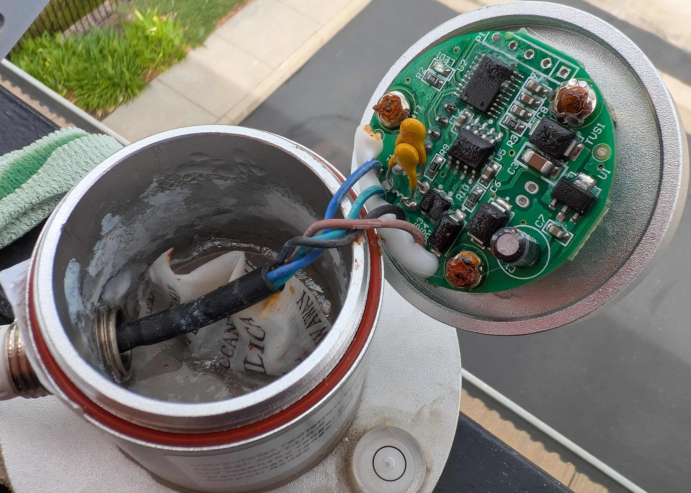
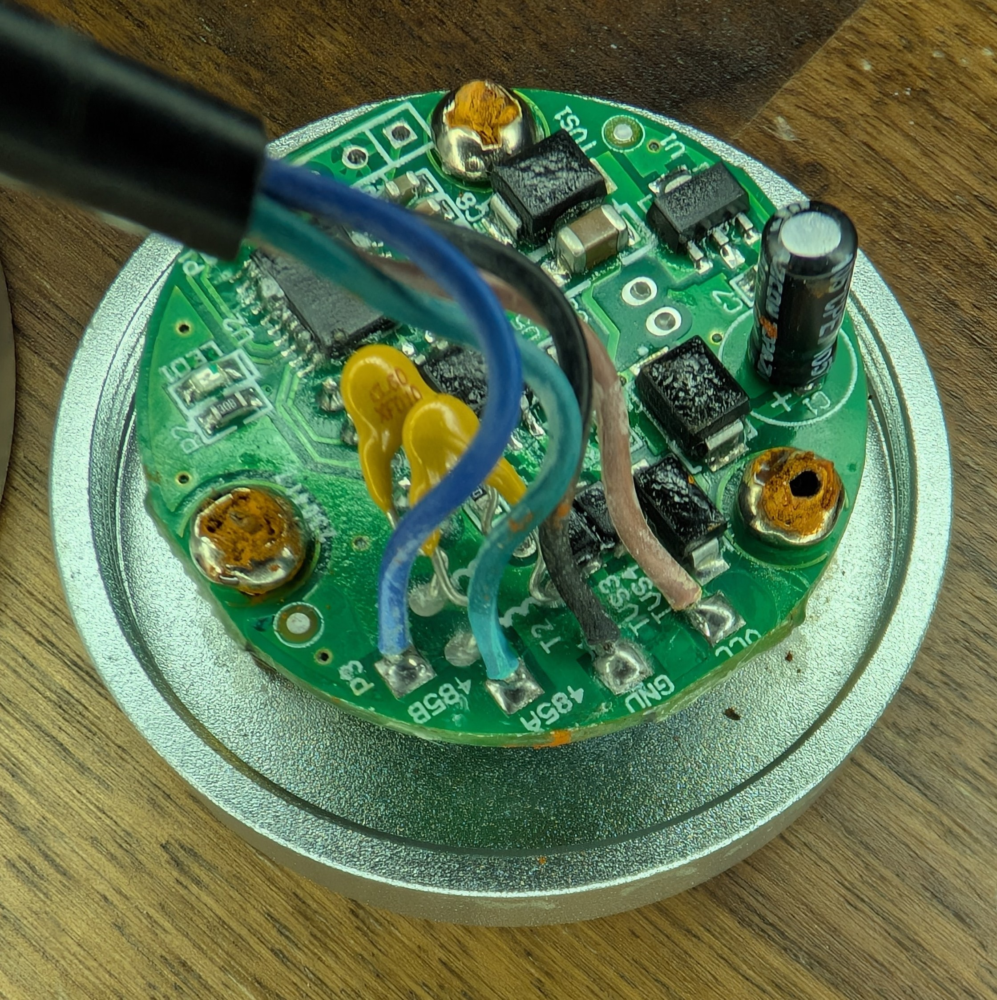
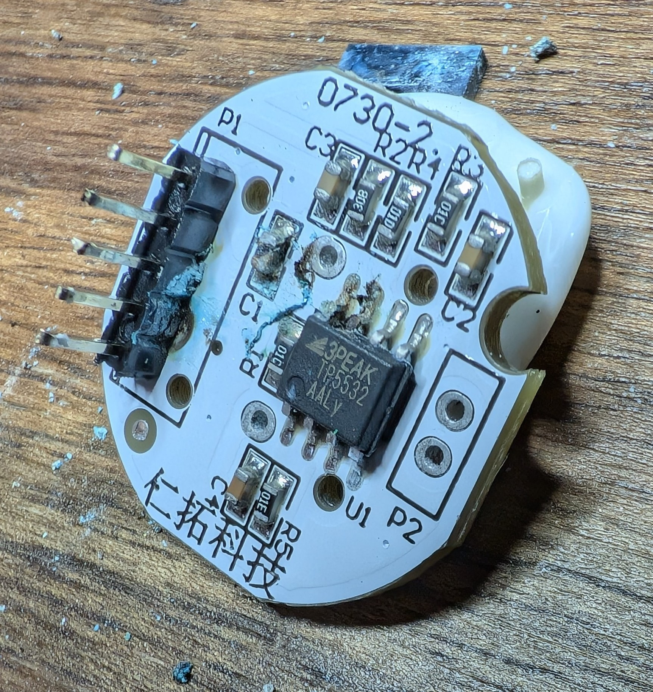
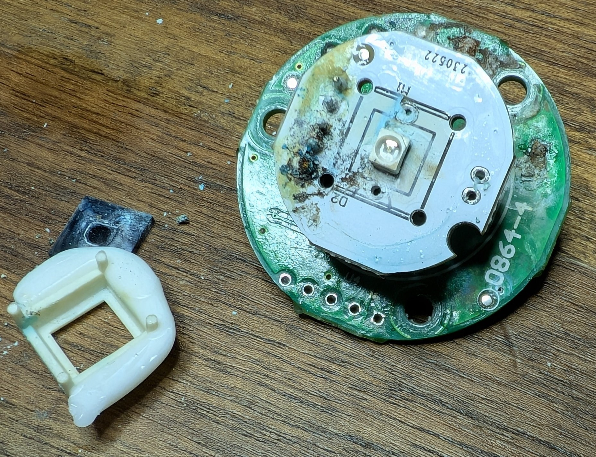
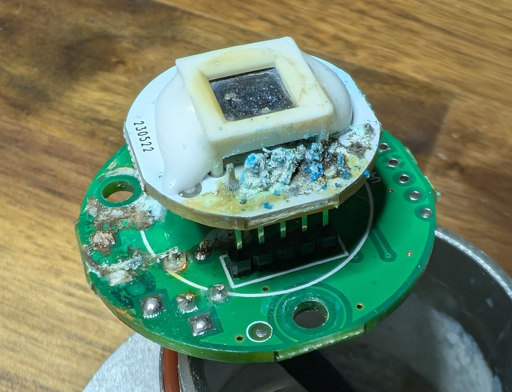

<!-- markdownlint-disable-file MD045 -->
# Failure analysis of the CWT-UR-S

To make a long story short, water ingress killed this device.

Here's what it looks like inside:

## ICs

After spending _way_ too much time scraping conformal coating off, the three ICs are _mostly_ identified:

- The RS485 transceiver is unmarked.
- The main MCU is [`HC32L110`](https://www.keil.arm.com/subfamily/hdsc-hc32l110-series-hc32l110/).
- There is a `3PEAK TP5532` OP-AMP on the sensor PCB. Presumably used for signal conditioning before the ADC.
