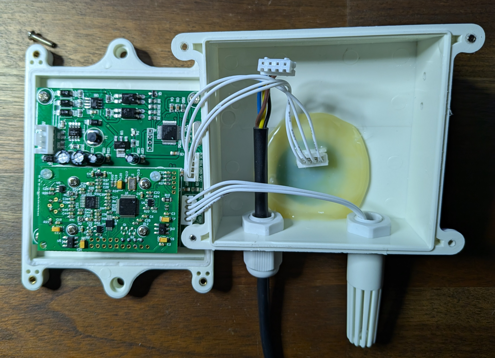
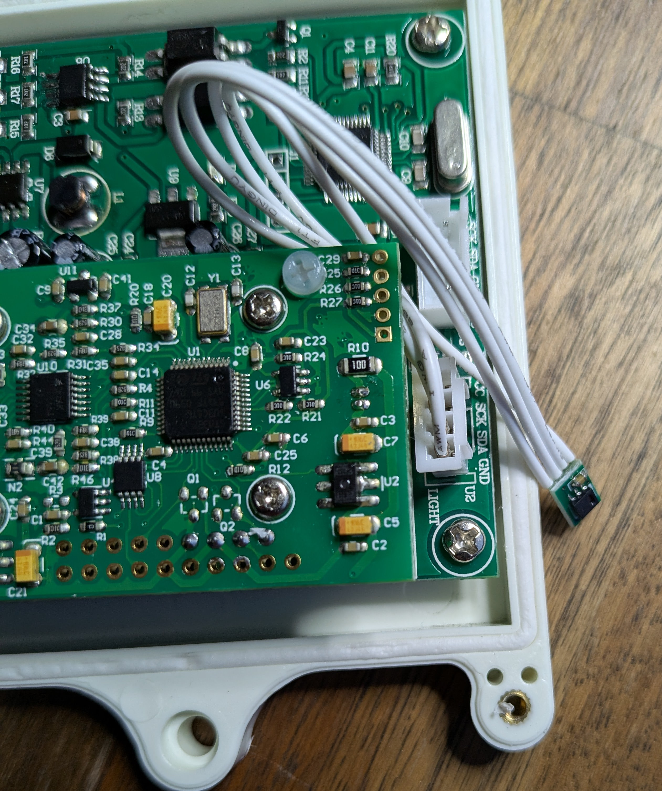

<!-- markdownlint-disable-file MD045 -->
# Logoele D679 CO2 Light Illumination Temperature Humidity 4in1

I was curious about which sensors are used so I opened it up.

The lux sensor is probably a BH1750FVI but the whole thing is covered in glue so I can't be sure.

The raised up board is the co2 sensor. The daughter board is soldered to the main PCB so I can't see which sensor is used for co2.



Also interesting to note, the lux and temp/humidity sensors are on the same I2C bus but with different pin outs.



PCB indicates spring 2019 design date.


## demo

```shell
❯ ./demo.py
Reading inline script metadata from `./demo.py`
2024-12-03 17:02:54 [debug    ] All data                       all_data=[906, 2174, 4295, 2] co2=906 lux=8 relative_humidity=42.95 temp=21.74
2024-12-03 17:02:54 [debug    ] Individual data                co2=904 lux=8 relative_humidity=42.95 temp=21.74
```
